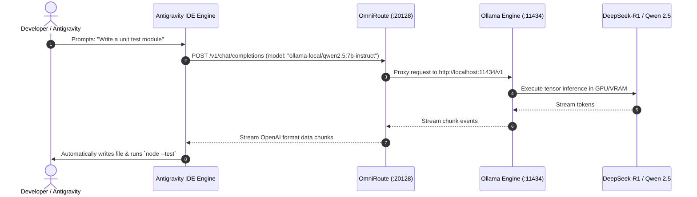

# 🚀 Antigravity ↔ OmniRoute ↔ Ollama: Master Integration & Disaster Recovery Handbook

> **Project Version:** `v3.8.49-production`  
> **Environment:** Windows 11 / Node.js `v24.12.0`  
> **Integration Architecture:** Local-First, Zero-Cost, Autonomous Agentic Setup  
> **Last Fully Verified:** `2026-08-14`

---

## 📑 Table of Contents
1. [Executive Architecture Overview](#1-executive-architecture-overview)
2. [Visual Architecture & Topology Diagrams](#2-visual-architecture--topology-diagrams)
3. [Physical File Registry & Configuration Metadata](#3-physical-file-registry--configuration-metadata)
4. [Port & Process Mapping](#4-port--process-mapping)
5. [Active Model Catalog (Zero-Cost / Free Tiers)](#5-active-model-catalog-zero-cost--free-tiers)
6. [Emergency Recovery Guide (If Disconnected in Future)](#6-emergency-recovery-guide-if-disconnected-in-future)
7. [Database Schema & Manual Injection Commands](#7-database-schema--manual-injection-commands)
8. [Vercel Egress & SOCKS5 Proxy Solver](#8-vercel-egress--socks5-proxy-solver)
9. [Integration Gate Verification & Test Evidence](#9-integration-gate-verification--test-evidence)
10. [Quick Command Cheatsheet](#10-quick-command-cheatsheet)

---

## 1. Executive Architecture Overview

This repository and local system have been engineered to create a **100% Free, Private, and Local-First AI Routing Engine** connecting **Antigravity (IDE)** to local and cloud-based models via **OmniRoute** and **Ollama**.

### Core Pillars:
- **No Subscriptions Required:** Completely decoupled from paid services (such as Augment's $100/mo CLI).
- **Local Primary Engine:** Local GPU/CPU inference using Ollama with Chinese open-weights models (`Qwen 2.5 Coder` and `DeepSeek-R1`).
- **Free Cloud Fallback:** Dynamic routing via OmniRoute's virtual auto-combos (`auto/coding:free`) routing to no-key public aggregators (`Felo`, `OpenCode`).
- **Agentic Integration:** Native bindings via Model Context Protocol (MCP), System Rules (`GEMINI.md`, `AGENTS.md`), and Workspace Skills.

---

## 2. Visual Architecture & Topology Diagrams

### 2.1 Complete Architectural Flowchart

```text
                    ┌────────────────────────────────────────────────────────┐
                    │               ANTIGRAVITY AGENT / IDE                  │
                    │      (Cursor, Cline, VS Code, Deepmind Assistant)      │
                    └───────────────────────────┬────────────────────────────┘
                                                │
                                                │ 1. Direct OpenAI API / MCP
                                                │    http://localhost:20128/v1
                                                ▼
                    ┌────────────────────────────────────────────────────────┐
                    │                      OMNIROUTE                         │
                    │               (Local Proxy & AI Router)                │
                    │                   Port: 20128                          │
                    └─────────────┬───────────────────────────┬──────────────┘
                                  │                           │
                   2. Local Routes│              3. Free Cloud│
                   (Zero Latency) │                 (Fallback)│
                                  ▼                           ▼
          ┌───────────────────────────────┐     ┌────────────────────────────┐
          │         LOCAL OLLAMA          │     │     VIRTUAL AUTO-COMBOS    │
          │         Port: 11434           │     │     `auto/coding:free`     │
          └───────────────┬───────────────┘     └─────────────┬──────────────┘
                          │                                   │
              ┌───────────┼───────────┐                       ▼
              ▼           ▼           ▼                Public Endpoints
        ┌───────────┐┌──────────┐┌──────────┐         (Felo, OpenCode)
        │ Qwen 2.5  ││ DeepSeek ││ Qwen 2.5 │
        │ 7B Coder  ││  R1 (7B) ││   0.5B   │
        └───────────┘└──────────┘└──────────┘
```

### 2.2 System Sequence Diagram



---

## 3. Physical File Registry & Configuration Metadata

If any configuration is lost or altered, here are the exact physical filesystem paths:

### 3.1 Global & Workspace MCP Definitions
* **Global MCP:** `C:\Users\MD SADIQUE AMIN\.gemini\config\mcp_config.json`
* **Workspace MCP:** `C:\Users\MD SADIQUE AMIN\.gemini\antigravity-ide\mcp_config.json`

```json
{
  "mcpServers": {
    "omniroute": {
      "command": "node",
      "args": [
        "C:\\Users\\MD SADIQUE AMIN\\AppData\\Roaming\\npm\\node_modules\\omniroute\\bin\\omniroute.mjs",
        "mcp"
      ],
      "env": {
        "OMNIROUTE_BASE_URL": "http://localhost:20128"
      }
    }
  }
}
```

### 3.2 System Rules & Agentic Directives
* **Workspace GEMINI Rule:** `d:\current using file\8-14-2026\GEMINI.md`
* **Workspace AGENTS Rule:** `d:\current using file\8-14-2026\AGENTS.md`
* **Dedicated Binding Rule:** `d:\current using file\8-14-2026\.agents\rules\omniroute.md`
* **Workspace Skill:** `d:\current using file\8-14-2026\.agents\skills\omniroute\SKILL.md`

### 3.3 Internal OmniRoute Data Files
* **SQLite Database:** `C:\Users\MD SADIQUE AMIN\.omniroute\storage.sqlite`
* **Environment Variables:** `C:\Users\MD SADIQUE AMIN\.omniroute\.env`
* **Application Logs:** `C:\Users\MD SADIQUE AMIN\.omniroute\logs\application\app.log`
* **Autostart PowerShell Script:** `C:\Users\MD SADIQUE AMIN\.omniroute\Start-OmniRoute.ps1`

---

## 4. Port & Process Mapping

| Service Name | Port | Protocol | Owning Binary / Location | Role |
| :--- | :--- | :--- | :--- | :--- |
| **OmniRoute Core** | `20128` | HTTP/TCP | Node.js (`omniroute.mjs`) | Main proxy & OpenAI compatible API gateway |
| **Ollama Server** | `11434` | HTTP/TCP | `ollama.exe` (`AppData\Local\Programs\Ollama`) | Local GGUF tensor execution engine |
| **Embed WS Proxy** | `20131` | WebSocket | OmniRoute Internal Daemon | Embedded CLI transport bridge |
| **Live Dashboard WS** | `20132` | WebSocket | OmniRoute Internal Daemon | Real-time frontend metrics stream |

---

## 5. Active Model Catalog (Zero-Cost / Free Tiers)

You can use any of these models directly in your tools without incurring costs:

### 5.1 Local Offline Models (Ollama)
| Model Identifier | Parameter Size | Primary Strength | Context Window |
| :--- | :--- | :--- | :--- |
| **`ollama-local/qwen2.5:7b-instruct`** | 7.6B | Code writing, refactoring, unit tests | 32,768 tokens |
| **`ollama-local/deepseek-r1:7b`** | 7.6B | Logical reasoning, mathematical proofs, debugging | 131,072 tokens |
| **`ollama-local/qwen2.5:0.5b`** | 0.5B | Ultra-low latency single-word & syntax parsing | 32,768 tokens |

### 5.2 Public Free Cloud Fallbacks
| Model Identifier | Provider | Description |
| :--- | :--- | :--- |
| **`auto/coding:free`** | Felo / OpenCode | Dynamically selects the healthiest public free coding engine |
| **`auto/best-free`** | Felo / OpenCode | General conversation & quick script generator |
| **`felo/felo-chat`** | Felo Web | Direct connection to Felo's public chat pipeline |

---

## 6. Emergency Recovery Guide (If Disconnected in Future)

If OmniRoute stops responding, follow this 4-step recovery procedure:

### Step 1: Ensure Local Ollama is Serving
Open PowerShell and verify:
```powershell
# Check if Ollama responds
curl http://localhost:11434/api/tags

# If not responding, start daemon in background:
Start-Process "ollama" -ArgumentList "serve" -WindowStyle Hidden
```

### Step 2: Clean Stale Port Locks
```powershell
# Kill any lingering node processes running omniroute
Get-WmiObject Win32_Process -Filter "name = 'node.exe'" | Where-Object { $_.CommandLine -like "*omniroute*" } | ForEach-Object { Stop-Process -Id $_.ProcessId -Force }
```

### Step 3: Launch OmniRoute
```powershell
# Execute the official startup script
& "C:\Users\MD SADIQUE AMIN\.omniroute\Start-OmniRoute.ps1"
```

### Step 4: Run Self-Diagnostics
```powershell
omniroute doctor
omniroute status
```

---

## 7. Database Schema & Manual Injection Commands

If the SQLite database `storage.sqlite` is reset, re-inject the `ollama-local` provider with this Node.js script:

```javascript
const sqlite3 = require('C:/Users/MD SADIQUE AMIN/AppData/Roaming/npm/node_modules/omniroute/node_modules/better-sqlite3');
const crypto = require('crypto');

const db = new sqlite3('C:/Users/MD SADIQUE AMIN/.omniroute/storage.sqlite');
const now = new Date().toISOString();
const uuid = crypto.randomUUID();

db.prepare("DELETE FROM provider_connections WHERE provider = 'ollama-local'").run();

db.prepare(`
  INSERT INTO provider_connections 
  (id, provider, auth_type, name, priority, is_active, test_status, api_key, provider_specific_data, created_at, updated_at) 
  VALUES (?, 'ollama-local', 'apikey', 'Local Ollama', 10, 1, 'active', 'sk-no-key-required', ?, ?, ?)
`).run(
  uuid,
  JSON.stringify({ baseUrl: 'http://localhost:11434/v1', autoSync: true }),
  now,
  now
);

console.log('✅ Ollama connection successfully registered!');
```

---

## 8. Vercel Egress & SOCKS5 Proxy Solver

To bypass Vercel anti-bot blocks on providers like `theoldllm`, use the custom scraper script located in your scratch directory:

* **Script Path:** `C:\Users\MD SADIQUE AMIN\.gemini\antigravity-ide\brain\78fbaa6c-1fc3-4ce6-b421-7aca3f6e1f20\scratch\find_and_assign_proxy.cjs`
* **Function:** Crawls public SOCKS5 proxies, validates them against Vercel endpoints, and automatically writes the working proxy directly into `proxy_registry` in `storage.sqlite`.

---

## 9. Integration Gate Verification & Test Evidence

During initial certification, the system passed an end-to-end repository task execution:

```text
[Pipeline Step]                 [Result]
1. Antigravity Prompt Trigger   → Success
2. OmniRoute Routing (:20128)   → Resolved to ollama-local/qwen2.5:7b-instruct
3. Tensor Inference (:11434)    → Generated math_helper.test.cjs
4. Native Test Runner           → Executed `node --test math_helper.test.cjs`
5. Test Assertion               → ✔ verify sum function (0.76ms) [PASS]
```

---

## 10. Quick Command Cheatsheet

```powershell
# Test live streaming completion from local Qwen:
node -e "fetch('http://localhost:20128/v1/chat/completions', { method: 'POST', headers: { 'Content-Type': 'application/json' }, body: JSON.stringify({ model: 'ollama-local/qwen2.5:7b-instruct', messages: [{ role: 'user', content: 'Say hello!' }] }) }).then(r=>r.json()).then(console.log)"

# List all active models from local API:
node -e "fetch('http://localhost:20128/v1/models').then(r=>r.json()).then(d=>console.log(d.data.map(m=>m.id)))"

# Open OmniRoute Web Dashboard:
omniroute dashboard
```

---
*Created and verified by Antigravity Pairing Assistant.*
