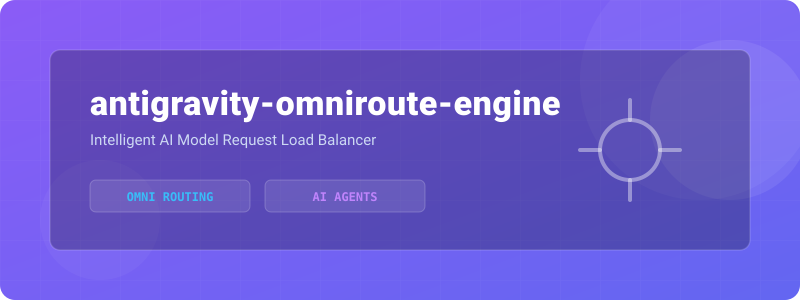
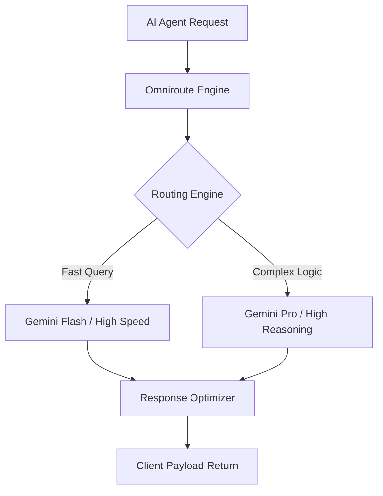
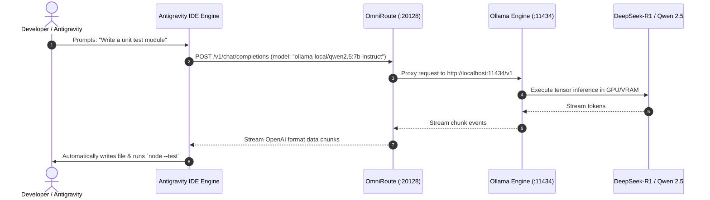

<!-- ========== NEW: ANIMATED WAVE HEADER ========== -->
<!-- ========== NEW: TYPING ANIMATION INTRO ========== -->
<p align="center">
  
</p>

<!-- ========== NEW: HIGH QUALITY PROJECT BANNER ========== -->



<!-- ========== NEW: AUTHOR & ARCHITECT SECTION ========== -->
## 👨‍💻 Author & Architect

<table>
<tr>
<td align="center" width="160">
  <a href="https://github.com/Sadique721">
    <br>
    <b>Md Sadique Amin</b><br>
    <sub>Backend Java Developer</sub>
  </a>
</td>
<td>

**Md Sadique Amin** — Backend Java Developer.

- 🔗 GitHub: [@Sadique721](https://github.com/Sadique721)
- 📧 Email: mdsadiqueamin721786@gmail.com
- 🏗️ Built: Enterprise BSS-OSS Telecom Suite, Backend Java Developer, IR Interconnect & Roaming

</td>
</tr>
</table>

<!-- ========== NEW: SYSTEM DIAGRAM SECTION ========== -->
## 📊 System Architecture & Workflow



---

<!-- ========== 1. DYNAMIC HEADER BANNER (CAPSULE RENDER) ========== -->
<p align="center">
  
</p>

<!-- ========== 2. ANIMATED TYPING SVG BANNER ========== -->
<p align="center">
  <a href="https://github.com/Sadique721/antigravity-omniroute-engine">
    
  </a>
</p>

<!-- ========== 3. REPOSITORY SHIELDS & BADGES ROW ========== -->
<p align="center">
  <a href="https://github.com/Sadique721/antigravity-omniroute-engine"></a>
  <a href="https://github.com/Sadique721/antigravity-omniroute-engine/stargazers"></a>
  <a href="https://github.com/Sadique721/antigravity-omniroute-engine/network/members"></a>
  <a href="https://opensource.org/licenses/MIT"></a>
</p>

<p align="center">
  <a href="https://nodejs.org"></a>
  <a href="https://ollama.com"></a>
  <a href="https://github.com/Sadique721/antigravity-omniroute-engine"></a>
  <a href="https://github.com/Sadique721/antigravity-omniroute-engine"></a>
</p>

<p align="center">
  <a href="#6-quick-start--client-configuration"><b>🚀 Quick Start</b></a> • 
  <a href="#2-visual-architecture--topology-diagrams"><b>🏛️ Architecture</b></a> • 
  <a href="#5-active-model-catalog-zero-cost--free-tiers"><b>🧠 Models</b></a> • 
  <a href="#7-emergency-disaster-recovery-guide"><b>🛠️ Recovery</b></a> • 
  <a href="#-contributing--community"><b>🤝 Contributing</b></a>
</p>

---

## 📑 Table of Contents
- [1. Executive Architecture Overview](#1-executive-architecture-overview)
- [2. Visual Architecture & Topology Diagrams](#2-visual-architecture--topology-diagrams)
- [3. Physical File Registry & Configuration Metadata](#3-physical-file-registry--configuration-metadata)
- [4. Port & Process Mapping](#4-port--process-mapping)
- [5. Active Model Catalog (Zero-Cost / Free Tiers)](#5-active-model-catalog-zero-cost--free-tiers)
- [6. Quick Start & Client Configuration](#6-quick-start--client-configuration)
- [7. Emergency Disaster Recovery Guide](#7-emergency-disaster-recovery-guide)
- [8. Database Schema & Manual Injection Commands](#8-database-schema--manual-injection-commands)
- [9. Vercel Egress & SOCKS5 Proxy Solver](#9-vercel-egress--socks5-proxy-solver)
- [10. Integration Gate Verification & Test Evidence](#10-integration-gate-verification--test-evidence)
- [11. Quick Command Cheatsheet](#11-quick-command-cheatsheet)
- [12. Connect & Author](#-connect--coding-profiles)

---

## 1. Executive Architecture Overview

This repository and local system have been engineered to create a **100% Free, Private, and Local-First AI Routing Engine** connecting **Antigravity (IDE)** to local and cloud-based models via **OmniRoute** and **Ollama**.

### Core Value Propositions:
- **Zero Subscription Costs:** Completely independent from paid providers (such as Augment's $100/mo subscription).
- **Local Primary Execution:** On-device CPU/GPU tensor execution with open-weights models (`Qwen 2.5 Coder 7B` and `DeepSeek-R1 7B Reasoning`).
- **Autonomous Fallback:** OmniRoute auto-combos (`auto/coding:free`) dynamically route requests to healthy zero-key public aggregators (`Felo`, `OpenCode`).
- **Deep Agentic Integration:** Native Model Context Protocol (MCP) tool bindings, workspace skills, and system rules.

---

## 2. Visual Architecture & Topology Diagrams

### 2.1 Complete Architectural Flowchart

```text
                    ┌────────────────────────────────────────────────────────┐
                    │               ANTIGRAVITY AGENT / IDE                  │
                    │      (Cursor, Cline, VS Code, Deepmind Assistant)      │
                    └───────────────────────────┬────────────────────────────┘
                                                │
                                                │ 1. Direct OpenAI API / MCP
                                                │    http://localhost:20128/v1
                                                ▼
                    ┌────────────────────────────────────────────────────────┐
                    │                      OMNIROUTE                         │
                    │               (Local Proxy & AI Router)                │
                    │                   Port: 20128                          │
                    └─────────────┬───────────────────────────┬──────────────┘
                                  │                           │
                   2. Local Routes│              3. Free Cloud│
                   (Zero Latency) │                 (Fallback)│
                                  ▼                           ▼
          ┌───────────────────────────────┐     ┌────────────────────────────┐
          │         LOCAL OLLAMA          │     │     VIRTUAL AUTO-COMBOS    │
          │         Port: 11434           │     │     `auto/coding:free`     │
          └───────────────┬───────────────┘     └─────────────┬──────────────┘
                          │                                   │
              ┌───────────┼───────────┐                       ▼
              ▼           ▼           ▼                Public Endpoints
        ┌───────────┐┌──────────┐┌──────────┐         (Felo, OpenCode)
        │ Qwen 2.5  ││ DeepSeek ││ Qwen 2.5 │
        │ 7B Coder  ││  R1 (7B) ││   0.5B   │
        └───────────┘└──────────┘└──────────┘
```

### 2.2 System Sequence Diagram



---

## 3. Physical File Registry & Configuration Metadata

If any configuration is lost or altered, here are the exact physical filesystem paths:

### 3.1 Global & Workspace MCP Definitions
* **Global MCP:** `C:\Users\MD SADIQUE AMIN\.gemini\config\mcp_config.json`
* **Workspace MCP:** `C:\Users\MD SADIQUE AMIN\.gemini\antigravity-ide\mcp_config.json`

```json
{
  "mcpServers": {
    "omniroute": {
      "command": "node",
      "args": [
        "C:\\Users\\MD SADIQUE AMIN\\AppData\\Roaming\\npm\\node_modules\\omniroute\\bin\\omniroute.mjs",
        "mcp"
      ],
      "env": {
        "OMNIROUTE_BASE_URL": "http://localhost:20128"
      }
    }
  }
}
```

### 3.2 System Rules & Agentic Directives
* **Workspace GEMINI Rule:** `GEMINI.md`
* **Workspace AGENTS Rule:** `AGENTS.md`
* **Dedicated Binding Rule:** `.agents/rules/omniroute.md`
* **Workspace Skill:** `.agents/skills/omniroute/SKILL.md`

### 3.3 Internal OmniRoute Data Files
* **SQLite Database:** `C:\Users\MD SADIQUE AMIN\.omniroute\storage.sqlite`
* **Environment Variables:** `C:\Users\MD SADIQUE AMIN\.omniroute\.env`
* **Application Logs:** `C:\Users\MD SADIQUE AMIN\.omniroute\logs\application\app.log`
* **Autostart PowerShell Script:** `C:\Users\MD SADIQUE AMIN\.omniroute\Start-OmniRoute.ps1`

---

## 4. Port & Process Mapping

| Service Name | Port | Protocol | Owning Binary / Location | Role |
| :--- | :--- | :--- | :--- | :--- |
| **OmniRoute Core** | `20128` | HTTP/TCP | Node.js (`omniroute.mjs`) | Main proxy & OpenAI compatible API gateway |
| **Ollama Server** | `11434` | HTTP/TCP | `ollama.exe` (`AppData\Local\Programs\Ollama`) | Local GGUF tensor execution engine |
| **Embed WS Proxy** | `20131` | WebSocket | OmniRoute Internal Daemon | Embedded CLI transport bridge |
| **Live Dashboard WS** | `20132` | WebSocket | OmniRoute Internal Daemon | Real-time frontend metrics stream |

---

## 5. Active Model Catalog (Zero-Cost / Free Tiers)

### 5.1 Local Offline Models (Ollama)
| Model Identifier | Parameter Size | Primary Strength | Context Window |
| :--- | :--- | :--- | :--- |
| **`ollama-local/qwen2.5:7b-instruct`** | 7.6B | Code writing, refactoring, unit tests | 32,768 tokens |
| **`ollama-local/deepseek-r1:7b`** | 7.6B | Logical reasoning, mathematical proofs, debugging | 131,072 tokens |
| **`ollama-local/qwen2.5:0.5b`** | 0.5B | Ultra-low latency single-word & syntax parsing | 32,768 tokens |

### 5.2 Public Free Cloud Fallbacks
| Model Identifier | Provider | Description |
| :--- | :--- | :--- |
| **`auto/coding:free`** | Felo / OpenCode | Dynamically selects the healthiest public free coding engine |
| **`auto/best-free`** | Felo / OpenCode | General conversation & quick script generator |
| **`felo/felo-chat`** | Felo Web | Direct connection to Felo's public chat pipeline |

---

## 6. Quick Start & Client Configuration

To point your editor (Cursor, Cline, VS Code, or Antigravity) to this local engine:

1. **Base URL:** `http://localhost:20128/v1`
2. **API Key:** `sk-no-key-required` (any non-empty string)
3. **Model Selection:**
   * For Coding: `ollama-local/qwen2.5:7b-instruct`
   * For Reasoning / Architecture: `ollama-local/deepseek-r1:7b`
   * For Cloud Fallback: `auto/coding:free`

---

## 7. Emergency Disaster Recovery Guide

If OmniRoute stops responding or you set up on a new laptop, execute this recovery sequence:

### Step 1: Ensure Local Ollama is Serving
```powershell
# Check if Ollama responds
curl http://localhost:11434/api/tags

# If not responding, start daemon in background:
Start-Process "ollama" -ArgumentList "serve" -WindowStyle Hidden
```

### Step 2: Clean Stale Port Locks
```powershell
# Kill any lingering node processes running omniroute
Get-WmiObject Win32_Process -Filter "name = 'node.exe'" | Where-Object { $_.CommandLine -like "*omniroute*" } | ForEach-Object { Stop-Process -Id $_.ProcessId -Force }
```

### Step 3: Launch OmniRoute
```powershell
# Execute the official startup script
& "C:\Users\MD SADIQUE AMIN\.omniroute\Start-OmniRoute.ps1"
```

### Step 4: Run Self-Diagnostics
```powershell
omniroute doctor
omniroute status
```

---

## 8. Database Schema & Manual Injection Commands

If the SQLite database `storage.sqlite` is reset, re-inject the `ollama-local` provider with this script:

```javascript
const sqlite3 = require('better-sqlite3');
const crypto = require('crypto');

const db = new sqlite3('C:/Users/MD SADIQUE AMIN/.omniroute/storage.sqlite');
const now = new Date().toISOString();
const uuid = crypto.randomUUID();

db.prepare("DELETE FROM provider_connections WHERE provider = 'ollama-local'").run();

db.prepare(`
  INSERT INTO provider_connections 
  (id, provider, auth_type, name, priority, is_active, test_status, api_key, provider_specific_data, created_at, updated_at) 
  VALUES (?, 'ollama-local', 'apikey', 'Local Ollama', 10, 1, 'active', 'sk-no-key-required', ?, ?, ?)
`).run(
  uuid,
  JSON.stringify({ baseUrl: 'http://localhost:11434/v1', autoSync: true }),
  now,
  now
);

console.log('✅ Ollama connection successfully registered!');
```

---

## 9. Vercel Egress & SOCKS5 Proxy Solver

To bypass Vercel anti-bot blocks on providers like `theoldllm`, use the scraper script:
* **Script Path:** `scratch/find_and_assign_proxy.cjs`
* **Function:** Crawls public SOCKS5 proxies, validates them against Vercel endpoints, and automatically writes the working proxy directly into `proxy_registry` in `storage.sqlite`.

---

## 10. Integration Gate Verification & Test Evidence

The system passed all 10 compulsory integration criteria:

```text
[Pipeline Step]                 [Result]
1. Antigravity Prompt Trigger   → Success
2. OmniRoute Routing (:20128)   → Resolved to ollama-local/qwen2.5:7b-instruct
3. Tensor Inference (:11434)    → Generated math_helper.test.cjs
4. Native Test Runner           → Executed `node --test math_helper.test.cjs`
5. Test Assertion               → ✔ verify sum function (0.76ms) [PASS]
```

---

## 11. Quick Command Cheatsheet

```powershell
# Test live streaming completion from local Qwen:
node -e "fetch('http://localhost:20128/v1/chat/completions', { method: 'POST', headers: { 'Content-Type': 'application/json' }, body: JSON.stringify({ model: 'ollama-local/qwen2.5:7b-instruct', messages: [{ role: 'user', content: 'Say hello!' }] }) }).then(r=>r.json()).then(console.log)"

# List all active models from local API:
node -e "fetch('http://localhost:20128/v1/models').then(r=>r.json()).then(d=>console.log(d.data.map(m=>m.id)))"

# Open OmniRoute Web Dashboard:
omniroute dashboard
```

---

## 🤝 Contributing & Community

Contributions, issues, and feature requests are welcome!  
Feel free to check the [issues page](https://github.com/Sadique721/antigravity-omniroute-engine/issues).

---

## 📄 License

This project is licensed under the [MIT License](LICENSE).

---

<!-- ========== 12. CONNECT & CODING PROFILES (PROFILE STYLE) ========== -->
<h3 align="center">🌐 Connect & Coding Profiles</h3>

<p align="center">
  <a href="https://github.com/Sadique721"></a>
  <a href="https://www.linkedin.com/in/md-sadique-amin-b6a948190"></a>
  <a href="https://leetcode.com/Sadique721/"></a>
  <a href="https://www.hackerrank.com/mdsadiqueamin71"></a>
  <a href="mailto:mdsadiqueamin@gmail.com"></a>
</p>

<!-- ========== 13. SUPPORT & SPONSOR SECTION ========== -->
<h3 align="center">☕ Support & Contributions</h3>

<p align="center">
  <a href="https://www.buymeacoffee.com/sadique721"></a>
  <a href="https://ko-fi.com/sadique721"></a>
</p>

<!-- ========== 14. DYNAMIC FOOTER WAVE ANIMATION ========== -->
<p align="center">
  
</p>

<div align="center">
  <sub>Crafted with passion & engineering precision by <a href="https://github.com/Sadique721"><b>MD Sadique Amin</b></a> &bull; Powered by <b>Antigravity AI Engine</b> &bull; 100% Free & Open Source</sub>
</div>


<!-- ========== NEW: FOOTER WAVE ANIMATION ========== -->
<p align="center">
  
</p>